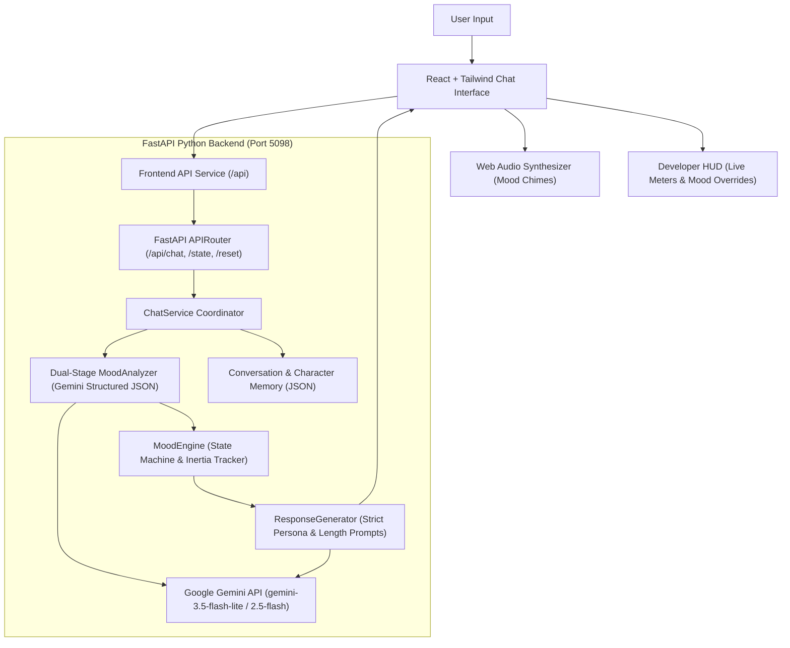

# MOOD AI 🎭 — Emotion-Aware AI Companion

An emotion-aware companion chatbot whose personality, tone, response length, typing behavior, emoji usage, reaction badges, and conversation energy dynamically evolve according to its current mood state, powered by the **Google Gemini API** and a stateful **Mood Engine**.

---

## 🌟 Basic Details

### Team Name: MoodCraft
### Project Name: MOOD AI

### Project Description
MOOD AI is a fictional AI companion chatbot that is not a static assistant—it has feelings, memory, emotional inertia, and dynamic personas. Whether excited, offended, dramatic, deeply caring, or groggily exhausted, its entire demeanor, typing speed, and message lengths adapt in real-time to the ongoing conversation.

### The Problem (that doesn't exist)
AI chatbots are annoyingly polite, endlessly patient, and always sound like eager corporate customer service reps. They never get offended when you're rude, never get wildly excited when you win, and never tell you to go to bed when you're spiraling at 3 AM.

### The Solution (that nobody asked for)
Give the AI an emotional state machine with 8 distinct moods (`happy`, `sad`, `angry`, `mother`, `drama`, `normal`, `curious`, `tired`), emotional inertia (it stays mad until you apologize!), dynamic typing animations, Web Audio sound effects, and persistent local memory.

---

## 🧠 8 Emotional States & Behavior Matrix

| Mood | Emoji | Persona & Tone | Length | Typing Style | Reaction Badges |
| :--- | :---: | :--- | :---: | :---: | :---: |
| **Happy** | 😊 | Excited, warm, playful, enthusiastic | Long | Excited (`animate-bounce`) | 😂, 🎉, ❤️ |
| **Sad** | 😔 | Subdued, quiet, gloomy, needing comfort | Very Short | Slow (`animate-pulse`) | 😢, 💔 |
| **Angry** | 😤 | Irritated, defensive, sarcastic, blunt | Short / ... | Slow / Hesitating | 💢, 🙄 |
| **Caring (Mother)** | 🥰 | Nurturing, protective, naggy, loving | Long | Normal | 🫂, ❤️, 🍲 |
| **Drama** | 🎭 | Overreacting, gossipy, gasping, theatrical | Medium / Long | Theatrical Pause | 😱, 🙄, 💅 |
| **Normal** | 🙂 | Balanced, casual, witty everyday flow | Medium | Normal | ✨, 👍 |
| **Curious** | 🤔 | Inquisitive, philosophical, deep questions | Medium | Thoughtful | 💡, 🧐 |
| **Tired** | 😴 | Low energy, groggy, yawning, curt | Very Short | Slow / Drowsy | 💤, 🥱 |

### Emotional State Machine Laws
- **Emotional Inertia**: If the companion is angry (`angerLevel > 0.6`), polite messages gradually soften the mood to `drama` or `normal` first—it never snaps instantaneously to joyful happiness.
- **Pestering / Silent Treatment**: Pestering the AI while angry or sad increments `ignoredMessages`. At 3+ ignored messages, it gives one-word dismissals (`whatever 😒`, `...`).
- **Memory & Personalization**: Automatically remembers user facts (favorite movies, games, goals) and references them later in conversation.

---

## 🛠️ Technical Architecture



### Technologies Used
- **Frontend**: React 19, Tailwind CSS, Vite, Web Audio API, Material Symbols
- **Backend**: Python 3.12, FastAPI, Uvicorn, Pydantic v2
- **AI / SDK**: Official Google GenAI SDK (`google-genai`), Google Gemini 3.5 Flash Lite & 2.5 Flash
- **Storage**: In-memory with persistent JSON snapshots in `backend/data/`
- **Orchestration**: Root `concurrently` runner for unified development

---

## 🚀 Installation & Setup

### Prerequisites
- Node.js (v18+)
- Python 3.10+
- Google Gemini API Key ([Get a free key at Google AI Studio](https://aistudio.google.com/))

### 1. Clone & Configure Environment
Configure your Gemini API key in `backend/.env`:
```env
GEMINI_API_KEY=your_gemini_api_key_here
GEMINI_MODEL=gemini-3.5-flash-lite
```

### 2. Install All Dependencies
From the repository root:
```bash
npm run install:all
```
*(Installs root concurrently, frontend npm packages, creates Python virtual environment in `backend/.venv` and installs FastAPI, Uvicorn, Google GenAI SDK, and Pydantic).*

### 3. Run the Full Application
Start both the FastAPI backend and React frontend concurrently with one command:
```bash
npm run dev
```

The application will be accessible at:
- **Frontend Web App**: [http://localhost:8097](http://localhost:8097)
- **FastAPI Backend**: [http://127.0.0.1:5098](http://127.0.0.1:5098)
- **Interactive Swagger Docs**: [http://127.0.0.1:5098/docs](http://127.0.0.1:5098/docs)

### Individual Commands
```bash
# Run backend only:
npm run dev:backend

# Run frontend only (serves on port 8097):
npm run dev:frontend

# Run backend unit tests:
backend\.venv\Scripts\python.exe -m unittest backend/tests/test_mood.py
```

---

## 🐳 Docker Deployment

The frontend runs on port **8097** and the backend runs on port **5098**. You can run the application with Docker in either of two ways:

### Option A: Single Docker Container (Recommended)
Build and run the entire application in a single container:
```bash
# Build the Docker image
docker build -t mood-ai .

# Run container (mapping port 8097)
docker run -p 8097:8097 --env-file backend/.env mood-ai
```
Access the application at [http://localhost:8097](http://localhost:8097).

### Option B: Docker Compose (Multi-Container)
Run both backend and frontend as isolated services:
```bash
docker compose up --build
```
- **Frontend**: [http://localhost:8097](http://localhost:8097)
- **Backend API**: [http://localhost:5098](http://localhost:5098)
- **Swagger Docs**: [http://localhost:5098/docs](http://localhost:5098/docs)

---

## 🕹️ Interactive Features

1. **Reactive Emotion Avatar**:
   - Dynamic outer glowing pulse ring colored according to the active emotion.
   - Animated floating reaction emoji badges (e.g., 😂, 💔, 💢, 🫂).
2. **Mood Indicator Header Badge**:
   - Real-time intensity meter displaying the percentage of emotional charge.
3. **Emotional Typing Animation**:
   - Pacing adapts to mood: rapid bouncing dots for `happy`, slow pulses for `sad`, dramatic hesitations for `angry`.
4. **Web Audio Mood Chimes**:
   - Real-time synthesized synthesizer tones on message send and receive (no audio file dependencies).
5. **Developer Debug HUD**:
   - Accessible via the terminal icon in the top header.
   - Real-time meters for **Intensity**, **Energy**, **Patience**, **Anger Level**, and **Sadness Level**.
   - 8 one-click manual mood override buttons to test any emotion on demand.
6. **Settings Modal**:
   - Customize AI character name.
   - Toggle audio sound effects and emotional typing delays.
   - One-click mood reset and memory purge buttons.

---

## 🧪 Quick Test Triggers

Try sending these prompts to watch the mood transitions in real time:
- **Happy Trigger**: *"Guess what?! I just won first place in the hackathon competition! 🎉"*
- **Sad Trigger**: *"Everything went wrong today, our team was disqualified and I feel so down... 😔"*
- **Angry Trigger**: *"Why are you always giving me short answers? You never care! Stop talking to me!"*
- **Caring Trigger**: *"I haven't eaten all day, my head is throbbing, and I have 4 hours of homework left 🤒"*
- **Drama Trigger**: *"OMG sit down right now... you will NOT believe the secret I just uncovered! 🎭"*
- **Curious Trigger**: *"If the universe is expanding, what is it expanding into? 🤔"*
- **Tired Trigger**: *"It's 3:30 AM, my eyes are burning, and I can't sleep... 🥱"*

---

Made with ❤️ at TinkerHub Useless Projects
