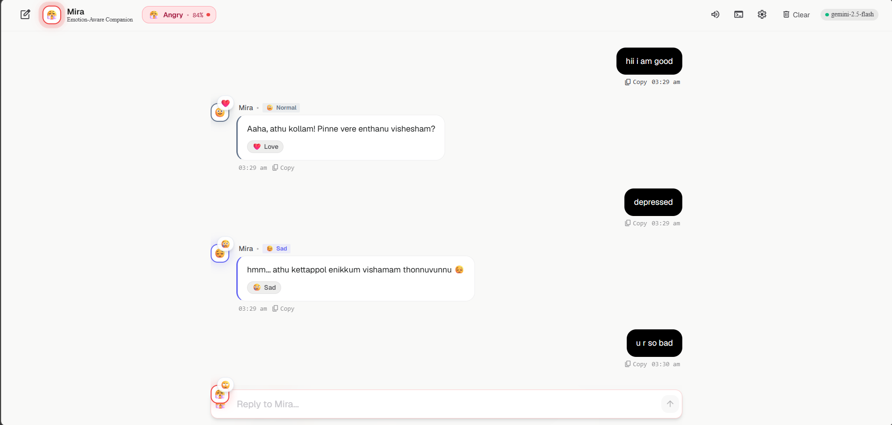
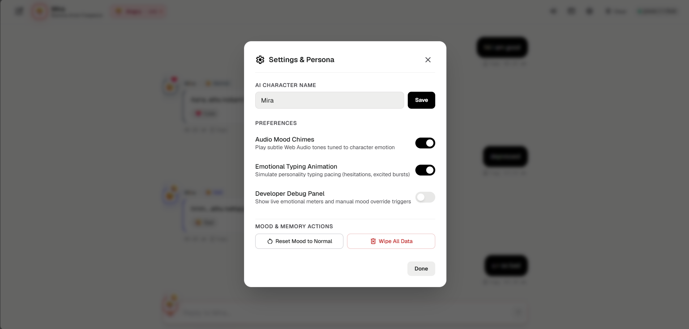
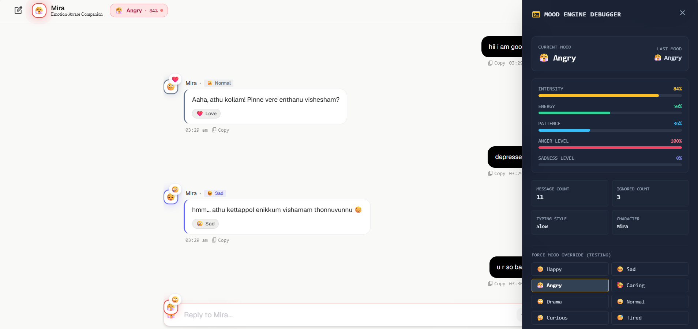
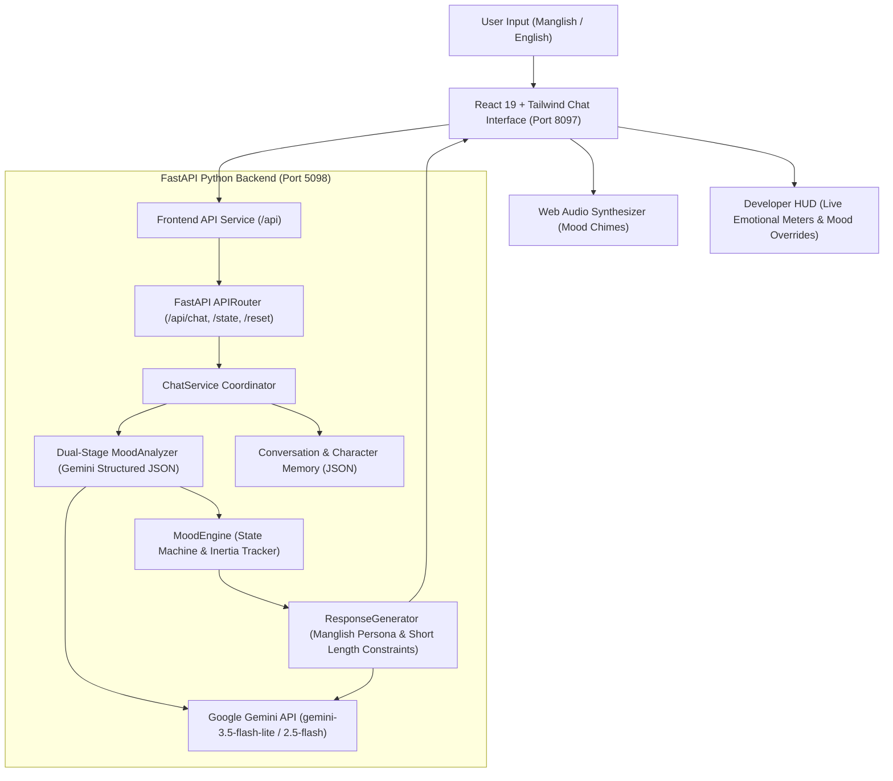

# MIRA AI 🎯


## Basic Details
### Team Name: Pirates


### Team Members
- Team Lead: Sangeeth - CEA
- Member 2: Navaneeth Krishna A - CEA

### Project Description
MOOD AI is an emotion-aware AI companion chatbot whose personality, tone, response length, typing behavior, emoji usage, reaction badges, and conversation energy dynamically evolve according to its real-time emotional state. Powered by the Google Gemini API and a stateful Mood Engine, it chats in snappy, realistic Manglish with emotional inertia and authentic human attitude.

### The Problem (that doesn't exist)
Traditional AI chatbots are annoyingly polite, endlessly patient, and always sound like eager corporate customer service reps. They never get offended when you're rude, never get wildly excited when you celebrate, never give you the silent treatment when pestered at 3 AM, and never talk back like a real friend would.

### The Solution (that nobody asked for)
Give the AI an emotional state machine with 8 distinct moods (`happy`, `sad`, `angry`, `mother`, `drama`, `normal`, `curious`, `tired`), realistic emotional inertia (she stays mad at you until you genuinely apologize!), silent treatment logic, dynamic typing animations, Web Audio sound effects, a developer debug HUD, and conversational replies strictly in witty, short Manglish!

#### 🧠 8 Emotional States & Behavior Matrix

| Mood | Emoji | Persona & Tone | Length | Typing Style | Reaction Badges |
| :--- | :---: | :--- | :---: | :---: | :---: |
| **Happy** | 😊 | Excited, warm, playful, enthusiastic | Short / Snappy | Excited (`animate-bounce`) | 😂, 🎉, ❤️ |
| **Sad** | 😔 | Subdued, quiet, gloomy, needing comfort | Very Short | Slow (`animate-pulse`) | 😢, 💔 |
| **Angry** | 😤 | Irritated, defensive, sarcastic, blunt | Short / ... | Slow / Hesitating | 💢, 🙄 |
| **Caring (Mother)** | 🥰 | Nurturing, protective, naggy, loving | Short / Snappy | Normal | 🫂, ❤️, 🍲 |
| **Drama** | 🎭 | Overreacting, gossipy, gasping, theatrical | Short / Snappy | Theatrical Pause | 😱, 🙄, 💅 |
| **Normal** | 🙂 | Balanced, casual, witty everyday flow | Short / Snappy | Normal | ✨, 👍 |
| **Curious** | 🤔 | Inquisitive, philosophical, deep questions | Short / Snappy | Thoughtful | 💡, 🧐 |
| **Tired** | 😴 | Low energy, groggy, yawning, curt | Very Short | Slow / Drowsy | 💤, 🥱 |

#### Emotional State Machine Laws
- **Emotional Inertia**: If the companion is angry (`angerLevel > 0.6`), polite messages gradually soften the mood to `drama` or `normal` first—it never snaps instantaneously to joyful happiness.
- **Pestering / Silent Treatment**: Pestering the AI while angry or sad increments `ignoredMessages`. At 3+ ignored messages, it gives one-word dismissals (`whatever 😒`, `...`).
- **Memory & Personalization**: Automatically remembers user facts (favorite movies, games, goals) and references them later in conversation.

---

## Technical Details
### Technologies/Components Used
For Software:
- Languages: Python 3.12, JavaScript (ES6+)
- Frameworks: React 19, FastAPI, Tailwind CSS
- Libraries: Google GenAI SDK (`google-genai`), Vite, Uvicorn, Pydantic v2, Web Audio API, Concurrently
- Tools: Docker, Docker Compose, Nginx, Node.js, npm, pip, venv

For Hardware:
- Main Components: None (Pure Software Project)
- Specifications: Modern web browser with Web Audio API support (Chrome / Edge / Firefox / Safari)
- Tools Required: PC / Laptop, Internet connection (for Google Gemini API access)

### Implementation
For Software:
# Installation
```bash
# 1. Clone the repository
git clone https://github.com/Sajeevbkk/useless_project_temp.git
cd useless_project_temp

# 2. Configure Environment Variables
# Create backend/.env and add your Gemini API Key:
GEMINI_API_KEY=your_gemini_api_key_here
GEMINI_MODEL=gemini-3.5-flash-lite

# 3. Install All Dependencies (Root, Frontend, and Backend Virtual Environment)
npm run install:all
```
*(Installs root concurrently runner, frontend npm packages, creates Python virtual environment in `backend/.venv` and installs FastAPI, Uvicorn, Google GenAI SDK, and Pydantic).*

# Run
```bash
# Run both Frontend (React) and Backend (FastAPI) concurrently
npm run dev

# The application is accessible at:
# Frontend Web App: http://localhost:8097
# FastAPI Backend: http://127.0.0.1:5098
# Swagger API Docs: http://127.0.0.1:5098/docs

# Or run services individually:
npm run dev:frontend   # Frontend only (serves on port 8097)
npm run dev:backend    # Backend only (serves on port 5098)

# Run backend unit tests:
backend\.venv\Scripts\python.exe -m unittest backend/tests/test_mood.py
```

### Docker Deployment
The frontend runs on port **8097** and the backend runs on port **5098**.

#### Option A: Single Docker Container (Recommended)
```bash
# Build the Docker image
docker build -t mood-ai .

# Run container (mapping port 8097)
docker run -p 8097:8097 --env-file backend/.env mood-ai
```
Access the application at [http://localhost:8097](http://localhost:8097).

#### Option B: Docker Compose (Multi-Container)
```bash
docker compose up --build
```
- Frontend: [http://localhost:8097](http://localhost:8097)
- Backend API: [http://localhost:5098](http://localhost:5098)
- Swagger Docs: [http://localhost:5098/docs](http://localhost:5098/docs)

### Project Documentation
For Software:

# Screenshots (Add at least 3)

*Main chat interface showing dynamic emotion avatar, real-time mood indicator badge, audio chimes toggle, and conversation.*


*Emotional response demonstrating angry state with intense mood meter, reactive badges, and sassy curt replies.*


*Developer HUD displaying real-time emotional meters (Intensity, Energy, Patience, Anger, Sadness) and 8 one-click mood override controls.*

# Diagrams

*End-to-end system architecture workflow: user messages flow through the React frontend to the FastAPI backend, where dual-stage Gemini analysis extracts emotional sentiment and updates the stateful Mood Engine. The response generator crafts strictly formatted, short Manglish replies reflecting the companion's current emotional state and inertia.*

For Hardware:

# Schematic & Circuit
*Not applicable - MOOD AI is a 100% software-based web application with no physical electronic circuits.*

# Build Photos
*Not applicable - No hardware assembly required. The application runs inside modern web browsers and Docker containers.*

### Project Demo
# Video
[Add your demo video link here]
*Walkthrough video demonstrating real-time mood shifts, emotional inertia recovery, sassy Manglish replies, and developer HUD controls.*

# Additional Demos
- **Interactive Swagger API Documentation**: [http://127.0.0.1:5098/docs](http://127.0.0.1:5098/docs) (when backend is running).
- **Developer Debug HUD**: Accessible via the terminal icon in the top header. Provides real-time meters for **Intensity**, **Energy**, **Patience**, **Anger Level**, and **Sadness Level**, alongside 8 one-click mood override buttons.
- **Interactive Settings**: Character name customization, sound effects toggle, emotional typing delays, and memory purge.
- **Quick Test Triggers**:
  - **Happy Trigger**: *"Guess what?! I just won first place in the hackathon competition! 🎉"*
  - **Sad Trigger**: *"Everything went wrong today, our team was disqualified and I feel so down... 😔"*
  - **Angry Trigger**: *"Why are you always giving me short answers? You never care! Stop talking to me!"*
  - **Caring Trigger**: *"I haven't eaten all day, my head is throbbing, and I have 4 hours of homework left 🤒"*
  - **Drama Trigger**: *"OMG sit down right now... you will NOT believe the secret I just uncovered! 🎭"*
  - **Curious Trigger**: *"If the universe is expanding, what is it expanding into? 🤔"*
  - **Tired Trigger**: *"It's 3:30 AM, my eyes are burning, and I can't sleep... 🥱"*

## Team Contributions
- Sangeeth: Architecture, FastAPI backend, Google Gemini API integration, dual-stage mood analyzer, and Docker containerization.
- Navaneeth Krishna A: React 19 frontend development, Web Audio sound effects synthesizer, responsive Tailwind UI, and developer HUD.

---
Made with ❤️ at TinkerHub Useless Projects 


